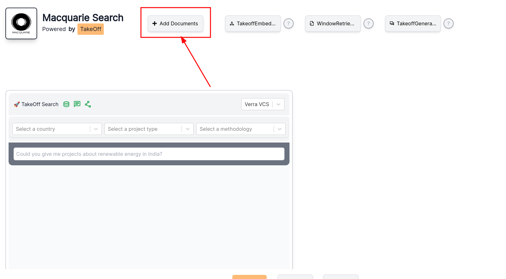
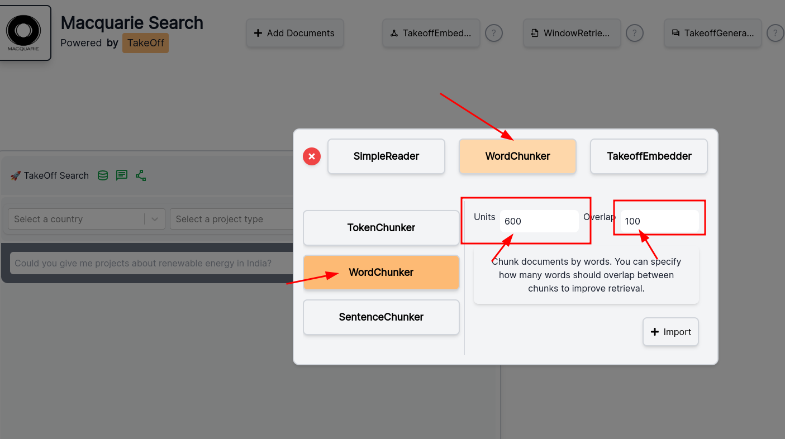

# Takeoff Search Helm Chart

This is our example template of a Helm chart for deploying Takeoff Search app in Kubernetes. 

## Prerequisites

### License Key Configuration

You must provide a license key in the `values.yaml` file. Leave the `takeoff_access_token` field empty for now. The secrets configuration below is where you will input your access token and license key, which are passed to the Takeoff container as environment variables:

```yaml
secrets:
  TAKEOFF_ACCESS_TOKEN: ""
  LICENSE_KEY: ""
```

## Launching

### Creating a Namespace

Start by creating a Kubernetes namespace for the deployment:

```bash
kubectl create namespace takeoffsearch 
```

### Installing the Helm Chart

Ensure you have configured the `values.yaml` and `takeoff-config.yaml` files with the appropriate settings for your deployment. Use the following command to install the Helm chart:

```bash
helm install takeoffsearch ./ --namespace takeoffsearch --values values.yaml
```

This command deploys the Takeoff search project into your Kubernetes cluster.

## Post-Installation

### Verifying the Application

After installing the Takeoffsearch Helm chart, you can verify if the search application is operational by forwarding the service port to your local machine:

```bash
kubectl port-forward service/takeoffsearch 8000:80 --namespace takeoffsearch
```

Open a web browser and navigate to `http://localhost:8000` to access the Takeoff search interface. Log in with the provided credentials.

- username: macquarie
- password: macquarie2024


### Data Injection

This section guides you through the process of injecting data into the Weaviate database for the application. The data is categorized into two main types:
- **Metadata**
- **Document Data**

#### Prerequisites
- Ensure you have the `weaviate-client` Python package installed.

#### Data Folder Structure
Your data should be organized as follows within the `search-data` directory:
```
search-data
├── cleaned_data
│   ├── cleaned_faolex.json              # Faolex metadata
│   ├── cleaned_registered.json          # Verra registered metadata
│   ├── faolex_policy_cleaned            # Faolex summary documents
│   ├── registered_clean                 # Verra registered summary documents
│   └── pdf_links.csv
└── populate_db.py                       # Script to populate metadata
```

### Populating the Metadata

1. **Port Forwarding**: Start by port forwarding the Weaviate service to your local machine. This can be achieved using the `kubectl` CLI or `k9s`:
    ```bash
    kubectl port-forward service/weaviate-service 8080:8080 --namespace takeoffsearch
    ```

2. **Run the Script**: With the service forwarded, execute the script `populate_db.py` located under the `search-data` folder to inject the metadata:
    ```bash
    cd search-data
    python3 populate_db.py
    ```

After running the script, verify the population of the metadata by visiting the website.

### Populating the Document Data

Populating the document data can be done easily through the frontend UI:

#### Step 1. Click the `Add Documents` button.


#### Step 2. Set the chunker to `word chunker` with units set to 600 and overlap to 100.


#### Step 3. Drag and drop the `document data folder` into the designated area. Select `Simple Reader` from the options and ensure the document category is correctly set.


#### Step 4. Repeat the process for Faolex

Notice: Verra has 2177 files; Faolex has 4533 files; the import will take approximately 10 minutes. You can view the process in the logs of the pod.

This process is a one-time setup. Once completed, the app will be ready for use.
